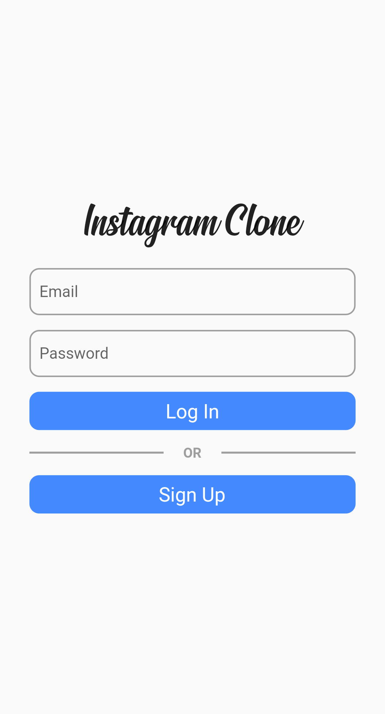
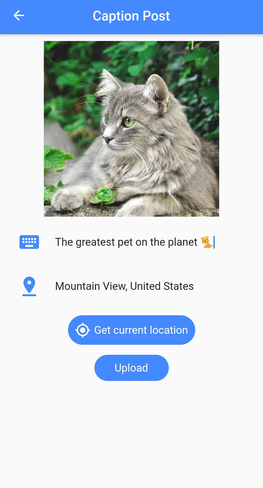

# Instagram-Clone
Instagram Clone using Flutter and Firebase

# Tech Stack
- **Flutter** for frontend
- **Bloc** for state management
- **Firebase** for backend

# Screenshots
    

# How to run this project in your local environment

>Note : Firebase emulator must be installed

- Clone the repo to your local environment
- Run `flutter pub get`
- Navigate to **/Instagram-Clone/Backend/functions** folder in command prompt
- Run `npm install`
- Navigate to **/Instagram-Clone/Backend**
- Run `firebase emulators:start --import=./dataSet --export-on-exit`
